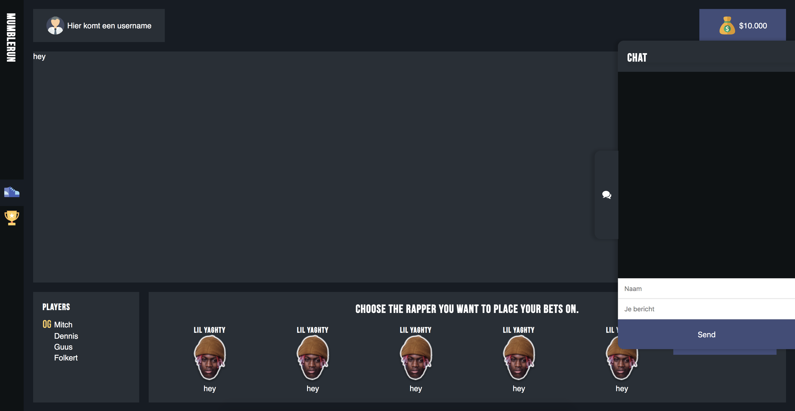
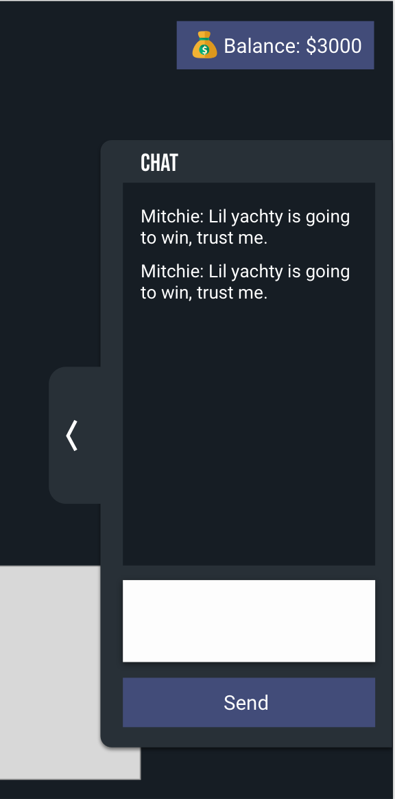
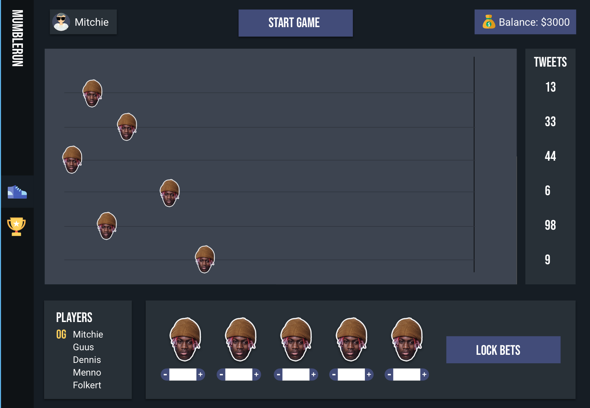
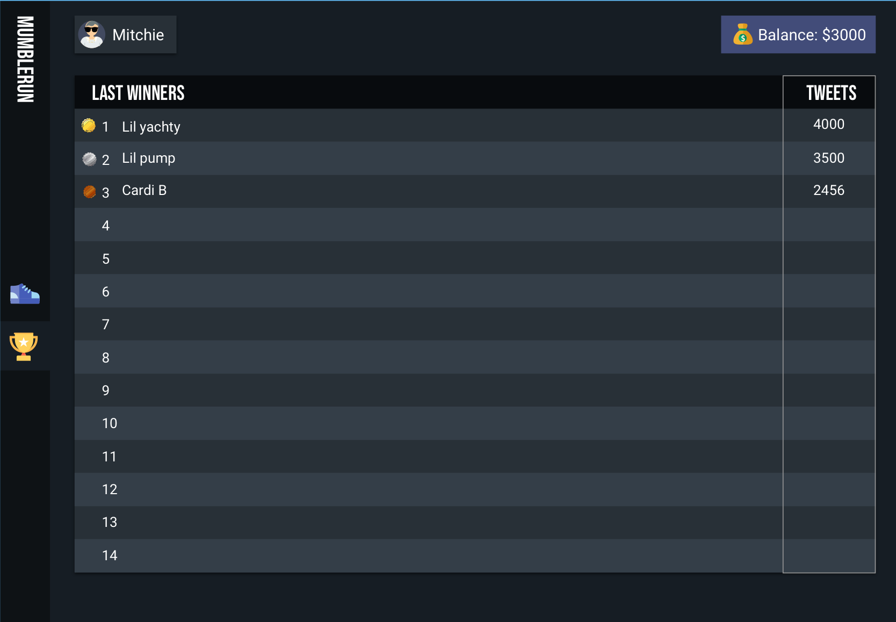

## MumbleRun

[livelink](.)

#### Beschrijving concept:

Mumblerun is een minigame dat bekende "mumble" rappers tegen elkaar laat racen door middel van de tweets waarin ze genoemd worden. Gebruikers van de website kunnen nepgeld inzetten op hun rapper en op deze manier wedden met elkaar. Ze kunnen chatten onderling met elkaar en de highscores bekijken. De tweets worden geteld doormiddel van de twitter API.

#### Beschrijving Twiter API:

Na het
De twitter API heeft een rate limit van 15requests per window maar het fijne aan het concept is dat 1 persoon de mogelijkheid krijgt om een request te doen en deze wordt door middel van socket IO naar alle gebruikers gestuurd.

De data die opgehaald wordt zijn alle tweets waarin de specifieke mumble rappers genoemd worden en deze worden op de racetrack getoond doormiddel van D3.

###### API key

Doormiddel van het aanvragen van een twitter developer account is het verkrijgen van de Api Key mogelijk.

###### Authorization

Doormiddel van Oauth wordt er toegang vergeven aan de twitter API.

#### Schets van meest belangrijke scherm met interactiemogelijkheden erbij.

Ik heb mijn app gelijk al deels gestyled in sketch.
|  | De chat in de applicatie zit verborgen maar is ten alle tijden open en dicht te toggelen. |
|--- |--- |

Doormiddel van 3d verschuiven de rappers over de "baan"/grafiek heen tot 1 van de rappers bij de 100 tweets is. Hierna wordt het geld bij elkaar opgeteld.

Op het scoreboard staat welke rapper het meest gewonnen heeft en om hoeveel tweets het ging.

#### Data life cycle

#### feedback

#### To do

- [x] Aanmaken twitter development account.
- [ ] Twitter koppelen aan de applicatie en opzetten stream.
- [ ] Data manipuleren.
- [ ] Data doorgeven via websockets.
- [ ] Implementeren van D3.
- [ ] Set-up highscores.
- [x] Styling van de app.
- [x] Chat werkend krijgen.

* Waar ze nog over twijfelen/ waar ze feedback op willen
  Wij kunnen dan per student een issue aanmaken met feedback en daarin bepalen of we ze nog willen uitdagen. Als het een student is die het wss wel gaat lukken kunnen we als suggestie geven om aan de slag te gaan met een database of bijv. offline support (en user feedback)
